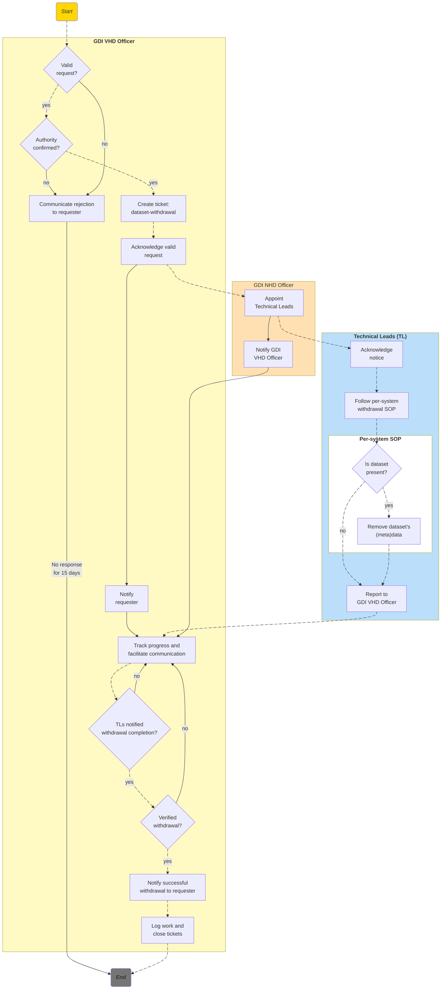

# European GDI - Dataset Withdrawal
| Metadata          | Value         |
|-------------------|---------------------|
| Template SOP number  | ``GDI-SOP0009`` |
| Template SOP version      | ``v1`` |
| Topic      | Data & metadata management |
| Template SOP Type      | European-level SOP |
| GDI Node   |  |
| Instance version     |  |

## Index

1. [Document History](#1-document-history)
2. [Glossary](#2-glossary)
3. [Roles and Responsibilities](#3-roles-and-responsibilities)
4. [Purpose](#4-purpose)
5. [Scope](#5-scope)
6. [Introduction and Background Information](#6-introduction-and-background-information)
7. [Summary or Context Diagram](#7-summary-or-context-diagram)
8. [Procedure](#8-procedure)
9. [References](#9-references)

### 1. Document History
| Template Version | Instance version | Author(s) | Description of changes       | Date       |
|---------|-----------|-----------|------------------------------|------------|
| ``v1.0.1`` |  | Marcos Casado Barbero | Address PR review comments | 2026.03.10 |
| ``v1`` |  | Marcos Casado Barbero | Draft SOP | 2026.01.16 |

### 2. Glossary
Find GDI SOPs common Glossary at the [**charter document**](../../docs/GDI-SOP_charter.md).

| Abbreviation | Description     |
|---------------|-----------------|
| CC | Carbon Copy |
| DPO | Data Protection Officer |
| EBI | European Bioinformatics Institute |
| EDIC | European Digital Infrastructure Consortium |
| EMBL | European Molecular Biology Laboratory |
| FAIR | Findability, Accessibility, Interoperability and Reusability |
| FDP | FAIR Data Point |
| GA4GH | Global Alliance for Genomics and Health |
| GDI | Genomic Data Infrastructure |
| GDPR | General Data Protection Regulation |
| HD | Helpdesk |
| ID | Identifier |
| IdP | Identity Provider |
| ISM | Information Service Management |
| LS | Life Science |
| NCP | Node Contact Point |
| NHD | Node Helpdesk |
| OC | Operations Committee |
| ORR | Organisational Roles and Responsibilities |
| PID | Permanent Identifier |
| REMS | Resource Entitlement Management System |
| SDPC | Security and Data Protection Committee |
| SOP | Standard Operating Procedure |
| SPE | Secure Processing Environment |
| TBD | To Be Determined |
| TB | Top to Bottom |
| TL | Technical Lead |
| UP | User portal |
| VHD | Virtual Helpdesk |
| WP | Work Package |

| Term          | Definition      |
|---------------|-----------------|
|Data controller|The natural or legal person, public authority, agency or other body that determines the purposes and means of processing the dataset and can authorise its withdrawal|
|Dataset version|A specific released state of a dataset identified by a version label/number, used to distinguish minor or major changes between releases|
|Beacon|A web-accessible service implementing the GA4GH Beacon specification, enabling federated discovery (and sometimes retrieval) of genomic variant and related biomedical data across distributed resources|
|Hard-deletion|Complete data removal from primary systems, plus documented handling of backups according to retention policy, with escalation if the request requires something stricter|
|JIRA| Software product developed by Atlassian that allows bug tracking, issue tracking and agile project management. |
|Requester|The person that initiates the request to the VHD for the dataset to be withdrawn|
|Soft-deletion|Data is marked as withdrawn and made inaccessible to users but retained internally for audit or limited-term retention|
|Tombstone record|A persistent landing page/metadata record kept in place of a removed dataset, providing citation and identifier details and stating the item is no longer available|
|Withdrawal|An exceptional action where a dataset (or research object) is removed from public access, typically retaining its persistent identifier and replacing access with a notice (often via a tombstone page/record)|


### 3. Roles and Responsibilities
See qualifications and responsibilities of the roles at the [**Organisational Roles and Responsibilities**](https://github.com/GenomicDataInfrastructure/standard-operating-procedures/blob/main/docs/GDI-SOP_organisational-roles-and-responsibilities.md) document.

| Role       | Full name       | GDI/node role   | Organisation |
|------------|-----------------|-----------------|--------------|
| Author     |Marcos Casado Barbero|Task 4.3 member|EMBL-EBI|
| Reviewer   |Silvia Bahena|Task 4.3 member|EMBL-EBI|
| Approver   |Kjell Petersen|Task 4.3 member|University of Bergen|
| Authorizer |Gabriele Rinck|Task 4.3 member|EMBL-EBI|

### 4. Purpose
The purpose of this SOP is to define the process for withdrawing a dataset from the European Genomic Data Infrastructure (GDI). Requests can be initiated by many parties, but execution requires controller authorisation or a valid legal basis and governance decision. This procedure ensures the removal is propagated swiftly and consistently across all services while meeting legal, ethical, and audit requirements. With it, GDI nodes protect data-subject rights, prevent continued exposure of withdrawn data, and maintain a transparent, documented record of the action.

### 5. Scope
This procedure applies to **all datasets within the GDI**, regardless of which system or node they were originally submitted to. It covers datasets submitted via any GDI component (i.e., storage and interfaces), including but not limited to: the **GDI Beacon network**, the **GDI User Portal catalog**, and **FAIR Data Points** (FDP) under GDI (see more details at [Step 7](#87-per-system-dataset-withdrawal)).

As a European-level SOP, it is designed to be directly implementable by all GDI nodes and centrally operated GDI services. The SOP addresses both **full dataset withdrawals** (removing an entire dataset from GDI) and **partial withdrawals** (removing or retracting a portion of a dataset, such as specific individuals' data). This SOP focuses on the **overarching process and coordination** required to withdraw the data across the GDI ecosystem.

It encompasses **data withdrawals triggered by a requester** (including data subjects). Note that execution must be authorised by the relevant data controller, or otherwise have a valid legal basis and governance decision. For example, controllers needing to (1) withdraw data (without an explicit user requesting it) to comply with regulations, or (2) withdraw data due to a explicit request from a data subject.

_Out of Scope_: This SOP does **not** cover the initial amendments during submission of datasets or routine data updates. Any system-specific technical steps for deletion (e.g., how to remove metadata from a GDI Beacon) are referenced but detailed in separate SOPs for those systems (see [Step 7](#87-per-system-dataset-withdrawal)).

### 6. Introduction and Background Information
The GDI is a federated network of national and European services that together enable discovery, access, and analysis of genomics and related health data. Because datasets may be copied, indexed, or exposed by multiple GDI components (e.g., GDI Storage, Beacon, FDP), withdrawing a dataset requires a coordinated cross-system process. This SOP supplies that process.

Legal and ethical obligations, like the General Data Protection Regulation (GDPR) [art. 17 "Right to erasure"](https://gdpr-info.eu/art-17-gdpr/), may require GDI to act without undue delay once the data controller has made a decision. Note that the right to erasure is not absolute and may be limited, for example for scientific research. The procedure defined here ensures:
- The dataset controller's decision is executed promptly and uniformly.
- All affected GDI systems receive consistent instructions.
- An auditable record of the withdrawal is maintained.

Component-specific technical steps (e.g., how to remove metadata from a GDI Beacon) are handled by referenced system-level SOPs (see [Step 7](#87-per-system-dataset-withdrawal)).

For a broader context of GDI SOPs, please refer to the [Charter](../../docs/GDI-SOP_charter.md#4-introduction).

### 7. Summary or Context Diagram



### 8. Procedure
#### 8.1. Evaluate withdrawal request
| Step identifier   | When| Who |
|:------------------|:----|:----|
| ``1`` | Anytime a person or organisation submits a ``dataset-withdrawal-request`` to the GDI Virtual Helpdesk (VHD) | VHD Officer |

Once the request is received, it is your responsibility as VHD Officer to evaluate its validity:
- The request **must contain**:
  - Dataset **identifier** (accession, title, or PID).
  - Requester **identity**, **relationship** to the dataset (e.g., 'I'm a data subject in the dataset'), and **contact** details (including stakeholders to CC during the process). This may be derived from the process that created the request to the VHD (e.g., a logged-in user).
  - **Scope**. This includes:
    - Whether the dataset is to be withdrawn **fully** or **partially** (e.g., "only withdraw a subject's metadata from the dataset").
    - Whether the withdrawal is to be done through **hard-** or **soft-deletion**. Whether this can be fulfilled in each GDI system is assessed later; here we only evaluate the request itself.
    - The **systems** where the dataset was uploaded (e.g., GDI Beacon, UP, FDP). This will not limit the withdrawal process to these systems alone, but helps trace data propagation through GDI.
- It is recommended, but **optional**, that the request contains:
   - **Reason** for withdrawal (consent withdrawal, legal order, error at submission, etc.).
- The request must pertain to a **suitable dataset**:
  - The dataset must have been **submitted to** (i.e., exist within) GDI. Its release status (i.e., publicly findable) may vary, but the withdrawal request is valid regardless of whether the dataset is publicly findable through GDI or yet to be released.

Upon inspection by the VHD Officer:
- If the request has all required information, move to ⏩[**step 3**](#83-verify-request-authority).
- If the request **does not** have all required information, it is **flagged as invalid**. Move to ⏩[**step 2**](#82-communicate-rejection-to-requester).

#### 8.2. Communicate rejection to requester
| Step identifier   | When| Who |
|:------------------|:----|:----|
| ``2`` | After the ``dataset-withdrawal-request`` was flagged **invalid** | VHD Officer |

Given that the evaluation of the request was negative, **communicate the outcome** to the requester through the same channel used for the request (e.g., email, user portal).

The communication should **include**:
- The **result** of the evaluation.
- The **reasoning** behind the evaluation.
- A **request** towards the requester to provide **further details** or **clarify elements** of the request, if applicable. 
   - This is extremely relevant if the request was rejected because it did not come from the data controller, but a data subject instead. In this case, you should refer the data subject to the data controller for them to open the request on their behalf.
- A **deadline of 15 days** for the requester to respond with the requested information or clarifications before the request ticket is closed. Phrase this in a way that encourages the requester to respond, rather than dismissing it (e.g., _"Please provide the requested information within 15 days so we can proceed with your request. If we do not receive a response by then, we will assume you wish to withdraw your request and will close the ticket."_).

You must **log the communication** appropriately (e.g., CC relevant lists or update ticket status).

After this communication:
- If the requester responds within **15 days**, return to ⏩[**step 1**](#81-evaluate-withdrawal-request).
- If the requester **does not** respond within **15 days**, the process concludes with rejection:
  - Document the rejection and executed waiting period in the ``dataset-withdrawal-request`` ticket.
  - Close the ``dataset-withdrawal-request`` ticket. 🔚

#### 8.3. Verify request authority
| Step identifier   | When| Who |
|:------------------|:----|:----|
| ``3`` | After the ``dataset-withdrawal-request`` was flagged **valid** | VHD Officer |

With the requester's details and available resources:
1. Confirm **dataset** record **exists in the GDI ecosystem**. This is ticked as long as the dataset identifier is recognised in at least **one** authoritative registry available to VHD (e.g., UP catalogue entry, FDP record, Beacon index). ✔️
1. Verify **requester's right** to act. Is it the **dataset controller**? ✔️
   - The request **must** come from the corresponding dataset controller. Therefore, if the requester does not fit that role, **flag the request as invalid** and move to ⏩[**step 2**](#82-communicate-rejection-to-requester).
1. Has the **data provider of the dataset** been made aware of the request?
   - If so, have they had the opportunity to raise concerns about scope, feasibility, or evidence? The ultimate decision is made by the data controller, but data providers may help to identify possible issues in the request.
1. Has the **European Digital Infrastructure Consortium** (EDIC) been made aware? This may be redundant depending on the VHD ticketing system, which the EDIC may operate and thus be aware by design.

**Only when** all '✔️' requirements are met, can the process move forward:
- If requirements (✔️) are met, move to ⏩[**step 4**](#84-log-and-acknowledge-valid-request)
- If requirements (✔️) are **not** met, the request is **flagged as invalid**. Move to ⏩[**step 2**](#82-communicate-rejection-to-requester).

#### 8.4. Log and acknowledge valid request
| Step identifier   | When| Who |
|:------------------|:----|:----|
| ``4``             |After requester authority is verified|VHD Officer|

Given that the request is valid and the requester has authority to withdraw the dataset:
- **Identify which GDI node has to execute the dataset withdrawal**. This would correspond to the GDI node that hosts the dataset to be withdrawn and, most likely, the one that initially received the dataset submission. Although unlikely, depending on the data to be withdrawn it may encompass multiple GDI nodes, and thus each applicable node will need to be contacted.
   - 💡 It may be the case that you yourself may be part of the applicable GDI node, and thus have **both the VHD and NHD Officer roles** ([step 5](#85-assign-withdrawal-response-team)) in this SOP.
- **Notify corresponding GDI Node Helpdesk (NHD) of the valid dataset withdrawal request**. The NHD officer(s) will be the one following through the actual dataset withdrawal at their respective nodes. Notification may vary depending on the system used, for it to be as straightforward as possible:
   - Ideally, you would **create a ticket** at the GDI node's operation ticket management system (e.g., JIRA). Add to this ticket as much information as necessary (e.g., screenshots, initial request details...) for the NHD Officer to follow through with the request at [step 5](#85-assign-withdrawal-response-team).
      - Create it with **type** ``dataset-withdrawal`` (see [GDI-SOP0008](../node-specific/GDI-SOP0008_node-helpdesk-ticket-classification.md)).
      - **Link it** to the initial ``dataset-withdrawal-request`` VHD ticket that was generated with the requester communication. As per the used system, this link should imply that the ``dataset-withdrawal-request`` ticket "is blocked by" this new ``dataset-withdrawal`` ticket.
      - Flag its ``priority`` as ``High``.
   - In the **absence** of this ticketing system, you may notify the GDI node's HD through **email** using the following template. 
      - Include relevant stakeholders from within GDI (_not the requester!_) in CC, like the OC (``gdi-oc [at] elixir-europe.org``) and SDPC (``gdi-sdpc [at] elixir-europe.org``).
      - Attach to the email any **supporting documentation** (e.g., verification of authority, screenshots, initial request...).
````
To: <Corresponding-GDI-node-Helpdesk>
CC: gdi-sdpc [at] elixir-europe.org, gdi-oc [at] elixir-europe.org
Subject: [<dataset-withdrawal TICKET_ID>][GDI SOP0009] Dataset withdrawal request
````
````
Dear GDI node Helpdesk,

A dataset-withdrawal request has been verified and logged in the GDI Virtual Helpdesk.

Request details:
- Ticket ID: <Internal TICKET_ID from GDI's VHD> (<TICKET_URL if applicable>)
- Date/time received: <DATETIME as YYYY.MM.DD>
- Requester details (do not contact the requester directly):
   - <REQUESTER_NAME> (<REQUESTER_ROLE>, <REQUESTER_INSTITUTION>)
- Dataset IDs: <list of relevant dataset IDs>
- Scope: <Whether the dataset is to be fully or partially withdrawn>
- Stated reason: <Reason for withdrawal from the requester if applicable>
- Requester authority: <The results of your investigation at step 3 of this SOP>
- Deadline requested: <Deadline of withdrawal if applicable>

ACTIONS NEEDED [Within 5 working days]:
1. Please follow through with the dataset withdrawal request as per [Step 5](https://github.com/GenomicDataInfrastructure/standard-operating-procedures/blob/main/sops/european-level/GDI-SOP0009_dataset-withdrawal.md#85-assign-withdrawal-response-team). 
2. Update the VHD ticket with assigned leads and expected completion timeline.

Once withdrawal is confirmed, the VHD will resume control to verify, notify the requester, and close the ticket.

Thank you for your prompt attention.  

Kind regards,  
<YOUR_NAME>
<YOUR_ROLE>
<YOUR_INSTITUTION>
GDI Virtual Helpdesk
````

- **Send acknowledgement to requester** ⚠️within **5 working days**⚠️. Use the following template, including ticket ID (the initial ID created upon receiving the withdrawal request) and summary of next steps.
````
To: <REQUESTER_EMAIL>
Subject: [<TICKET_ID>] Dataset withdrawal request
````
````
Dear <REQUESTER_NAME>,

We have logged your request to withdraw <DATASET_ID> (scope: <full_or_partial>) under ticket <TICKET_ID> and begun processing it.

Our operations team will coordinate the removal across GDI systems and keep you updated on progress.
If you have additional information, please reply to this email and include the ticket number in the subject.

Kind regards,
<YOUR_NAME>
GDI Virtual Helpdesk
<VHD_contact_details>
````
- Move to ⏩[**Step 6**](#86-track-dataset-withdrawal).

#### 8.5. Assign withdrawal response team
| Step identifier   | When| Who |
|:------------------|:----|:----|
| ``5``             |Within 5 working days after acknowledgment of valid request ([Step 4](#84-log-and-acknowledge-valid-request))|NHD Officer|

Now that the dataset withdrawal request has been logged and is being processed, as the NHD Officer you shall follow through the **actual dataset withdrawal** at your GDI node. In order to do so:
- **Review** ``dataset-withdrawal-request`` and ``dataset-withdrawal`` ticket details (or email details, depending on communication received from the VHD at [step 4](#84-log-and-acknowledge-valid-request)).
- **Appoint a Technical Lead** (TL) per GDI system (may be one or several people) at your **GDI node**, which hosts the data to be withdrawn. This is essentially assigning the responsibility of _actually_ withdrawing the dataset from the GDI systems at your node (e.g., storage, Beacon, FDP).
   - 💡 Depending on your node's composition, it may be the case that you yourself are the indicated person to be appointed as TL for your node's systems, and thus have **both the NHD Officer and TL roles** ([step 7](#87-per-system-dataset-withdrawal)) in this SOP.
   - If you are unsure who is responsible for what system, you may:
      - Rely on, and request help from, your Node Contact Point (NCP), Pillar II Work Package (WP) lead, and the OC/SDPC.
      - Take a look at GDI nodes' service portfolios. Also see hierarchy of GDI systems and relevant SOPs at [Step 7](#87-per-system-dataset-withdrawal).
   - TL **responsibilities** (aided by respective SOPs at [Step 7](#87-per-system-dataset-withdrawal)):  
     - Identify dataset presence (full or partial) in their respective GDI system.
     - Remove data if present.
- **Notify each appointed TL** of the dataset withdrawal request and their responsibilities. Notification may vary depending on the system used, for it to be as straightforward as possible:
   - Ideally, you would **create a ticket** at your GDI node's operation ticket management system (e.g., JIRA). Add to this ticket as much information as necessary (e.g., screenshots, initial request details...) for the TLs to follow through with the request at [step 7](#87-per-system-dataset-withdrawal).
   - In the **absence** of this ticketing system, you may notify the TLs through **email** using the following template.
      - Attach to the email any **supporting documentation** (e.g., verification of authority, screenshots, initial request...).
````
To: <Appointed-TLs>
Subject: [<dataset-withdrawal TICKET_ID>][GDI SOP0009] Dataset withdrawal for <GDI_SYSTEM>
````
````
Dear <TL_NAME>,

You are appointed **Technical Lead** (TL) for the dataset-withdrawal request detailed below:

- Ticket ID: <dataset-withdrawal TICKET_ID from GDI's VHD> (<TICKET_URL if applicable>)
- Dataset IDs: <list of relevant dataset IDs>
- Scope: <Whether the dataset is to be fully or partially withdrawn>
- System: <GDI system's name>
- Stated reason: <Reason for withdrawal from the requester>
- Requester authority: <copy-pasted from previous VHD Officer communication>
- Target completion date: <Deadline of withdrawal if applicable>

ACTIONS NEEDED:
1. Acknowledge receipt of this email **within 3 working days**.
2. Determine whether any (meta)data of the dataset resides in the specified GDI system.
3. If present, remove it (within the given scope) as per system SOP (see [Step 7](https://github.com/GenomicDataInfrastructure/standard-operating-procedures/blob/main/sops/european-level/GDI-SOP0009_dataset-withdrawal.md#87-per-system-dataset-withdrawal)).
4. Report dataset withdrawal status in the ticket or directly contacting GDI's VHD.

You can find more details about how these tasks have been fulfilled previously at [Step 7](https://github.com/GenomicDataInfrastructure/standard-operating-procedures/blob/main/sops/european-level/GDI-SOP0009_dataset-withdrawal.md#87-per-system-dataset-withdrawal).

If you need additional context or support, contact the OC/SDPC (gdi-sdpc [at] elixir-europe.org, gdi-oc [at] elixir-europe.org) or the VHD Officer (<VHD_OFFICER_CONTACT_DETAILS>).
Thank you for your prompt attention.

Best regards,
<YOUR_NAME>
<YOUR_ROLE>
<YOUR_INSTITUTION>
OC/SDPC Delegate
Genomic Data Infrastructure (GDI)
````
- Once a TL has been assigned (i.e., each has acknowledged it) to each of the GDI systems, **record assignments and target completion date** in the ``dataset-withdrawal`` ticket.
- **Notify the VHD Officer** (who managed the initial request) that leads are assigned. Include in the communication _who_ has been assigned _what_.
- This **concludes** your responsibilities as the NHD Officer with respect to this SOP. 🔚

#### 8.6. Track dataset withdrawal
| Step identifier   | When| Who |
|:------------------|:----|:----|
| ``6``             |From acknowledgement of request ([Step 4](#84-log-and-acknowledge-valid-request)) onward|VHD Officer|
While the ``dataset-withdrawal`` ticket is being solved (see [step 5](#85-assign-withdrawal-response-team) and [step 7](#87-per-system-dataset-withdrawal)), your role as VHD Officer is to:
- **Track status of ``dataset-withdrawal`` ticket** (including subtasks). This includes asserting that TLs are following up on their duties with regards to their GDI systems, and reminding them if not.
- **Follow up on overdue tasks** and escalate to OC/SDPC if needed.
- **Facilitate communication** between requester, TLs, NHD and committees. Communication with the requester should be kept minimal, and **only** happen through you as the VHD Officer (i.e., others should not contact directly the requester).

Once the ``dataset-withdrawal`` ticket has been completed (i.e., [Step 7](#87-per-system-dataset-withdrawal) has been performed for each GDI system), proceed to ⏩[**Step 8**](#88-verify-dataset-withdrawal).

#### 8.7. Per-system dataset withdrawal
| Step identifier   | When| Who |
|:------------------|:----|:----|
| ``7``             |After appointed as TL at [Step 5](#85-assign-withdrawal-response-team)|Technical Lead (TL)|

As the TL of a GDI system at your GDI node, your tasks are:
1. **Identify dataset presence**. Determine whether any (meta)data for the dataset to be withdrawn resides within the specified GDI system. This is especially relevant for any type of **submitted** (meta)data about an individual, from raw data files (e.g., ``.bam``, ``.vcf``) to metadata (e.g., biological sex, phenotype, country of origin).
2. **Remove dataset's (meta)data**.  If present, execute withdrawal in line with the relevant system-specific SOP and the requested scope (e.g., partial/full withdrawal, soft/hard deletion).
3. **Report status**. Update relevant stakeholders (mainly VHD Officer in charge of the ticket) about your progress within this step.

To accomplish these tasks, **follow the appropriate SOP** for your specified system:
- **LS Login** (_#! SOP TBD_):
   - Nodes' Identity Provider (IdP) (_#! SOP TBD_).
   - Node Access Management (_#! SOP TBD_).
- **User Portal** (UP) (_#! SOP TBD_).
   - Resource Entitlement Management System (REMS) (_#! SOP TBD_).
   - Beacon Browser (_#! SOP TBD_).
      - Nodes' Beacons (_#! SOP TBD, see https://github.com/GenomicDataInfrastructure/standard-operating-procedures/issues/64 #!_).
   - Dataset Browser (_#! SOP TBD_).
      - Nodes' FAIR Data Points (FDP) (_#! SOP TBD, see https://github.com/GenomicDataInfrastructure/standard-operating-procedures/issues/63 #!_).
   - Allele Frequency Browser (_#! SOP TBD_).
      - Nodes' Allele Frequency Beacons (_#! SOP TBD, see https://github.com/GenomicDataInfrastructure/standard-operating-procedures/issues/65 #!_).
- **Nodes' Secure Processing Environment** (SPE) (_#! SOP TBD_).

Once you have completed the relevant withdrawal SOP for the specified GDI System:
- **Notify VHD** of the outcome (e.g., 'there was no information...' or 'records X and Y were removed from...'). Include in your communication:
   - Details (e.g., query details, location of logs...) to help the VHD Officer verify the outcome.
   - New dataset/record IDs/accessions, if the scope was partial withdrawal, to document it at the original record.
- If the VHD Officer's **verification** (at [Step 8](#88-verify-dataset-withdrawal)) is **positive**, this **concludes** your responsibility as the TL for this GDI System with regards to this SOP. 🔚
   - If data withdrawal verification is **negative**, **clarify with the VHD Officer** and amend as needed.

#### 8.8. Verify dataset withdrawal
| Step identifier   | When| Who |
|:------------------|:----|:----|
| ``8``             |After all TLs have notified completion of [Step 7](#87-per-system-dataset-withdrawal)|VHD Officer|

Once all TLs have completed their respective per-system withdrawal SOPs, and thus notified you:
- **Verify withdrawal completion**. This may be simply checking that (meta)data for a GDI system was not present to begin with; or that it is no longer there after the completion of the withdrawal. In order to make this step easier, make use of the per-system SOPs at [Step 7](#87-per-system-dataset-withdrawal) and the information provided by each TL in their communication. If you cannot directly check each system to confirm the dataset removal, request an explicit confirmation and evidence (e.g., logs, query screenshots) from the respective TLs.
- **Document the outcome** of your investigations in the ``dataset-withdrawal`` ticket.
- Depending on the outcome:
   - If there is any GDI system that **does not pass** the verification (i.e., dataset has not been withdrawn within the required scope): **notify responsible TL** to clarify, letting the OC/SDPC know (e.g., through email).
   - If all checks pass and dataset is deemed ``withdrawn`` from GDI:
      - **Close the ``dataset-withdrawal`` ticket**, documenting the work done and outcome.
      - Proceed to ⏩[**Step 9**](#89-notify-requester-and-close-initial-ticket).

#### 8.9. Notify requester and close initial ticket
| Step identifier   | When| Who |
|:------------------|:----|:----|
| ``9``             |After verification ([step 8](#88-verify-dataset-withdrawal))|VHD Officer|

- Send **completion notice** to the initial requester. Include:
   - **Summary of the updated systems** (i.e., the ones where data was withdrawn). 
   - If available (ideally), provide the **new dataset version ID/accession** (i.e., the new one after the part that was withdrawn).
   - A brief reminder that [GDPR Article 19](https://gdpr-info.eu/art-19-gdpr) requires the data controller to communicate erasure/restriction/rectification to recipients (unless impossible or disproportionate), and to inform the data subject about recipients on request.
- **Close the ``dataset-withdrawal-request`` ticket**, documenting the work done and outcome.

### 9. References
| Reference | Description                                          |
|-----------|------------------------------------------------------|
| [1](../../docs/GDI-SOP_charter.md)    | European GDI - SOP Charter (including Glossary)      |
| [2](../../docs/GDI-SOP_information-service-management.md)    | European GDI - Procedures for Information Service Management (ISM) for SOPs |
| [3](../../docs/GDI-SOP_organisational-roles-and-responsibilities.md)    | European GDI - Organisational Roles and Responsibilities (ORR) |