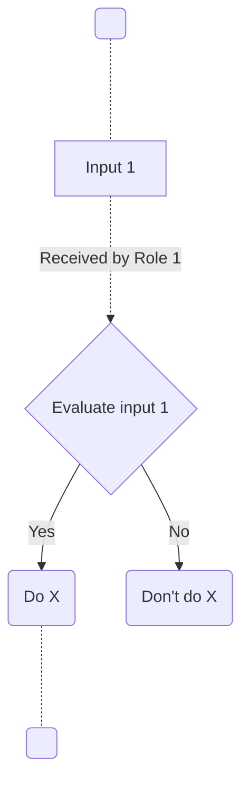

# European GDI - Dataset Withdrawal
| Metadata          | Value         |
|-------------------|---------------------|
| Template SOP number  | ``GDI-SOP0009`` |
| Template SOP version      | ``v0`` |
| Topic      | Data & metadata management |
| Template SOP Type      | European-level SOP |
| GDI Node   |  |
| Instance version     |  |

## Index

1. [Document History](#1-document-history)
2. [Glossary](#2-glossary)
3. [Roles and Responsibilities](#3-roles-and-responsibilities)
4. [Purpose](#4-purpose)
5. [Scope](#5-scope)
6. [Introduction and Background Information](#6-introduction-and-background-information)
7. [Summary or Context Diagram](#7-summary-or-context-diagram)
8. [Procedure](#8-procedure)
9. [References](#9-references)

### 1. Document History
| Template Version | Instance version | Author(s) | Description of changes       | Date       |
|---------|-----------|-----------|------------------------------|------------|
| ``v0`` |  | Marcos Casado Barbero | Draft SOP | 2025.07.11 |

### 2. Glossary
Find GDI SOPs common Glossary at the [**charter document**](https://github.com/GenomicDataInfrastructure/standard-operating-procedures/blob/main/docs/GDI-SOP_charter.md).

| Abbreviation | Description     |
|---------------|-----------------|
|      #!         |                 |
|GDPR|General Data Protection Regulation|
|GDI|Genomic Data Infrastructure|
|FEGA|Federated EGA|
|EGA|European Genome-phenome Archive|
|SOP|Standard Operating Procedure|
|VHD|Virtual Helpdesk|
|PID|Permanent Identifier|
|FDP|FAIR Data Point|
|UP|User portal|
|FAIR|Findability, Accessibility, Interoperability and Reusability|
|CC|Carbon Copy|
|SPE|Secure Processing Environment|
|TL|Technical Lead|
|IdP|Identity Provider|
|REMS|Resource Entitlement Management System|

| Term          | Definition      |
|---------------|-----------------|
|Requester|The person that initiates the request to the VHD for the dataset to be withdrawn|
|Data controller| |
|Hard-deletion| |
|Soft-deletion| |

### 3. Roles and Responsibilities
See qualifications and responsibilities of the roles at the [**Organisational Roles and Responsibilities**](https://github.com/GenomicDataInfrastructure/standard-operating-procedures/blob/main/docs/GDI-SOP_organisational-roles-and-responsibilities.md) document.

| Role       | Full name       | GDI/node role   | Organisation |
|------------|-----------------|-----------------|--------------|
| Author     | Marcos Casado Barbero |Task 4.3 member|EMBL-EBI|
| Reviewer   |                 |                 |              |
| Approver   |                 |                 |              |
| Authorizer |                 |                 |              |

### 4. Purpose
The purpose of this SOP is to define the process for withdrawing a dataset when requested by its controller European Genomic Data Infrastructure (GDI).Following its procedure ensures the removal is propagated swiftly and consistently across all services while meeting legal, ethical, and audit requirements. With it, GDI nodes protect data-subject rights, prevent continued exposure of withdrawn data, and maintain a transparent, documented record of the action.

### 5. Scope
This procedure applies to all datasets within the GDI, regardless of which system or node they were originally submitted to. It covers datasets submitted via any GDI component, including but not limited to: **Federated EGA** (FEGA), the **GDI Beacon network**, the **GDI User Portal catalog**, and **FAIR Data Portals** (FDP) under GDI. As a European-level SOP, it is designed to be directly implementable by all GDI nodes and services. The SOP addresses both **full dataset withdrawals** (removing an entire dataset from GDI) and **partial withdrawals** (removing or retracting a portion of a dataset, such as specific individuals' data). It encompasses withdrawals triggered by data subject consent withdrawal, legal or ethical obligations, quality issues, or voluntary retraction by the data controller. 

_Out of Scope_: This SOP does **not** cover the initial amendments during submission of datasets or routine data updates. It also does **not** cover suspension of _access_ without removal. Any system-specific technical steps for deletion (e.g., how to remove metadata from a GDI Beacon) are referenced but detailed in separate SOPs for those systems. 

This SOP focuses on the **overarching process and coordination** required to withdraw the data across the GDI ecosystem.

### 6. Introduction and Background Information
The GDI is a federated network of national and European services that together enable discovery, access, and analysis of genomics and related health data. Because datasets may be copied, indexed, or exposed by multiple GDI components (e.g., Federated EGA, Beacon, FAIR Data Portals), withdrawing a dataset requires a coordinated cross-system process. This SOP supplies that process.

Legal and ethical obligations, particularly the General Data Protection Regulation (GDPR) [art. 17 "Right to erasure"](https://gdpr-info.eu/art-17-gdpr/), require GDI to honour withdrawal requests without undue delay. The procedure defined here ensures:

- The dataset controller's decision is executed promptly and uniformly
- All affected GDI systems receive consistent instructions
- An auditable record of the withdrawal is maintained.

Component-specific technical steps (e.g., how to remove metadata from a GDI Beacon) are handled by referenced system-level SOPs.

For a broader context of GDI SOPs, please refer to the [Charter](../../docs/GDI-SOP_charter.md#4-introduction).

### 7. Summary or Context Diagram

_< If applicable, include a diagram (e.g., in mermaid or plantUML format) summarizing the SOP step-by-step. Diagrams could represent the larger context of where this particular SOP should be used, e.g., within a "virtual helpdesk", if that is useful. >_


### 8. Procedure
#### 8.1. Evaluate withdrawal request
| Step identifier   | When| Who |
|:------------------|:----|:----|
| ``1``             |Anytime a person or organisation submits a ``dataset-withdrawal-request`` request to the GDI Virtual Helpdesk (VHD)|VHD officer|
Once the request is received, it is the responsibility of the VHD to evaluate its idoneity:
- The request **must contain**:
   - Dataset **identifier** (accession, title, or PID)
   - **Scope**. This includes:
      - Whether the dataset is to be withdrawn **fully** or **partially** (e.g., _'only withdraw a subject's metadata from the dataset'_).
      - Whether the withdrawal is to be done through **hard-** or **soft-deletion**.  Whether or not this can be fulfilled in each GDI system is a different topic. Here we are just to evaluate the request itself.
      - The **systems** where the dataset was uploaded to (e.g., GDI Beacon, UP, FEGA, FDP, etc.) by the submitter. This will not limit the withdrawal process to these systems alone, but would help trace the propagation of data through GDI.
   - **Reason** for withdrawal (consent withdrawal, legal order, error at submission, etc.).
   - Requester **identity**, **authority** over the dataset and **contact** details (including stakeholders to CC during the process). This may be derived from the process that created the request to the VHD (e.g., a logged-in user).
- The request must pertain a **suitable dataset**:
   - The dataset must have been **submitted to** (i.e., it exists within the GDI ecosystem) and **released through** (i.e., it is publicly findable) GDI.

Upon inspection by the VHD officer:
- If the request has all required information, it is **flagged as valid**. Move to ⏩[**step 3**](#83-verify-request-authority).
- If the request **does not** has all required information, it is **flagged as invalid**. Move to ⏩[**step 2**](#82-communicate-evaluation-result-to-requester).

#### 8.2. Communicate evaluation result to requester
| Step identifier   | When| Who |
|:------------------|:----|:----|
| ``2``             |After ``dataset-withdrawal-request`` request was flagged as **invalid**|VHD Officer|
Given that the evaluation of the request was negative, **communicate the outcome** to the requester through the appropriate method. The method of communication depends on how the request was made initially (e.g., email, through the user portal, etc.).

The communication to the requester should **include**:
- The **result** of the evaluation.
- The **reasoning** behind the evaluation.
- A **request** from GDI VHD for the requester to provide **further details** when applicable, or to **clarify elements** of their request.

As the VHD officer, it is your responsibility to **log properly the communication** depending on the chosen method (e.g., adding in CC suitable mailing lists, or documenting ticket statuses).

After this communication:
- If the requester responds within **1 month**, move to ⏩[**step 1**](#81-evaluate-withdrawal-request).
- If the requester **does not** respond within **1 month**, this **concludes the process** resulting in rejection of the request. 
   - Document the rejection based on the communication and waiting period.
   - Close open tickets related to the request. 🔚

#### 8.3. Verify request authority
| Step identifier   | When| Who |
|:------------------|:----|:----|
| ``3``             |After ``dataset-withdrawal-request`` request was flagged as **valid**|VHD Officer|

With the provided details of the requester and the resources at your disposal:
1. Confirm **dataset** record that was requested to be withdrawn **exists in the GDI ecosystem** (in the respective services). ✔️
1. Verify **requester's right** to act:
   - Is it the **dataset controller**? ✔️
      - If not, has the requester sought the dataset controller approval? 
   - Is it the **node DPO** or **authorised staff**?
   - Is it a **data subject**?
      - If so, does its participant/subject match the ID held by controller in the dataset? In other words, is the participant part of the requested dataset?
   - Is it a **GDI member**?
      - If so, what right do they have over the dataset?
1. Has the **dataset submitter** been made aware of the request?
   - If so, have they have their right to **challenge** the decision? The ultimate decision is made by the data controller, but data submitters may help finding out possible issues in the request (scope, authority, etc.).
1. Has **GDI coordination** been made aware?

As indicated by the '✔️', **only when** the dataset is verified to exist within the GDI ecosystem, and the dataset controller has approved the withdrawal, the process can move forward. Thus:
- If requirements (✔️) are met, move to ⏩[**step 4**](#84-log-and-acknowledge-valid-request)
- If requirements (✔️) are **not** met, the request is **flagged as invalid**. Move to ⏩[**step 2**](#82-communicate-evaluation-result-to-requester).

#### 8.4. Log and acknowledge valid request
| Step identifier   | When| Who |
|:------------------|:----|:----|
| ``4``             |After requester authority has been verified and request is deemed valid|VHD Officer|

Given that the request is valid and the requester has authority to withdraw the dataset:
- **Create a VHD ticket** to tackle the dataset withdrawal itself:
   - Create it with **type** ``dataset-withdrawal``.
   - **Link it** to the initial ``dataset-withdrawal-request`` VHD ticket that was generated with the requester communication. As per your system, this link should imply that the ``dataset-withdrawal-request`` ticket "is blocked by" this new ``dataset-withdrawal`` ticket.
   - Flag its ``priority`` as ``High``.
- **Escalate the ticket**. Use the following email template to **communicate the request** with **your direct manager** (in CC) within GDI, the OC (``gdi-oc [at] elixir-europe.org``) and SDPC (``gdi-sdpc [at] elixir-europe.org``). _Note the ``[at]`` to be replaced with ``@``_.
   - Include relevant stakeholders from within GDI (not the requester!) in CC.
   - Attach to the email any **supporting documentation** (e.g., verification of authority, screenshots, initial request...).
````
To: gdi-sdpc [at] elixir-europe.org, gdi-oc [at] elixir-europe.org
CC: <your-direct-manager>
Subject: [<dataset-withdrawal TICKET_ID>][GDI SOP0009] Dataset withdrawal request
````
````
Dear OC/SDPC,

A dataset-withdrawal request has been verified and logged in the GDI Virtual Helpdesk.

Request details:
- Ticket ID: <Internal TICKET_ID from GDI's VHD> (<TICKET_URL if applicable>)
- Date/time received: <DATETIME as YYYY.MM.DD>
- Requester contact details:
   - <REQUESTER_NAME> (<REQUESTER_ROLE>, <REQUESTER_INSTITUTION>)
   - <REQUESTER_EMAIL_ADDRESS>
- Dataset IDs / Accessions: <list of relevant dataset IDs>
- Scope: <Whether the dataset is to be fully or partially withdrawn>
- Stated reason: <Reason for withdrawal from the requester>
- Requester authority: <The results of your investigation at step 3 of this SOP>
- Deadline requested: <Deadline of withdrawal if applicable>

ACTIONS NEEDED:
1. Please designate one or more technical leads to:
   a. Identify every GDI system or node where this dataset (or the specified subset) resides and is to be withdrawn from.  
   b. Notify each system owner and coordinate the withdrawal schedule.  
2. Update the VHD ticket with assigned leads and expected completion timeline.

See more details at [Step 5](https://github.com/GenomicDataInfrastructure/standard-operating-procedures/blob/main/sops/european-level/GDI-SOP0009_dataset-withdrawal.md#85-assign-withdrawal-response-team).

Once all systems confirm completion, the VHD will resume control to verify, notify the requester, and close the ticket.

Thank you for your prompt attention.  

Kind regards,  
<YOUR_NAME>
<YOUR_ROLE>
<YOUR_INSTITUTION>
GDI Virtual Helpdesk
````

- **Send acknowledgement to requester** within 5 working days. Use the following template, including ticket ID and summary of next steps.
````
To: <REQUESTER_EMAIL>
Subject: [<TICKET_ID>] Dataset withdrawal request
````
````
Dear <REQUESTER_NAME>,

We have logged your request to withdraw <DATASET_ID> (scope: <full_or_partial>) under ticket <TICKET_ID> and begun processing it.

Our operations team will coordinate the removal across GDI systems and keep you updated on progress.
If you have additional information, please reply to this email and include the ticket number in the subject line.

Kind regards,
<YOUR_NAME>
GDI Virtual Helpdesk
<VHD_contact_details>
````
- Move to ⏩[**Step 6**](#86-track-dataset-withdrawal).

#### 8.5. Assign withdrawal response team
| Step identifier   | When| Who |
|:------------------|:----|:----|
| ``5``             |Within 5 working days after effective communication from [Step 4](#84-log-and-acknowledge-valid-request)|OC/SDPC chair or delegate|

As the OC/SDPC delegate:
- **Review** ``dataset-withdrawal-request`` and ``dataset-withdrawal`` ticket details.
- **Appoint a Technical Lead** (TL) for each GDI system. This may be a single person, yourself, or multiple ones depending on the GDI systems. 
   - To know better who is responsible for what system, you may:
      - Request help from Pillar II Work Package (WP) leads.
      - Raise the topic at OC/SDPC meetings.
      - Take a look at GDI nodes' service portfolios. Also see hierarchy of GDI systems and relevant SOPs at [Step 7](#87-per-system-dataset-withdrawal).
   - The **responsibilities** of these TLs will be to **take action to fulfil the withdrawal request** (aided by respective SOPs), including:
      - Identifying if the the dataset to be withdrawn is contained (i.e., there's (meta)data of it), fully or partially, in their respective system.
      - If so, remove the dataset from their respective system.
   - Use the communication template provided below to communicate the task to each appointed TL:
````
To: 
CC: gdi-sdpc [at] elixir-europe.org, gdi-oc [at] elixir-europe.org
Subject: [<dataset-withdrawal TICKET_ID>][GDI SOP0009] Dataset withdrawal for <GDI_SYSTEM>
````
````
Dear <TL name>,

You have been appointed **Technical Lead** for the dataset-withdrawal request detailed below:

- Ticket ID: <dataset-withdrawal TICKET_ID from GDI's VHD> (<TICKET_URL if applicable>)
- Dataset IDs / Accessions: <list of relevant dataset IDs>
- Scope: <Whether the dataset is to be fully or partially withdrawn>
- System: <GDI system's name>
- Stated reason: <Reason for withdrawal from the requester>
- Requester authority: <copy-pasted from previous VHD officer communication>
- Target completion date: <Deadline of withdrawal if applicable>

Your tasks involve: (1) determining whether any (meta)data for the dataset resides in the specified GDI system; (2) removing the data if present; (3) report status of the withdrawal from the specified GDI system to <VHD_OFFICER_CONTACT_DETAILS>.

You can find more details about how these tasks have been fulfilled previously at [Step 7](https://github.com/GenomicDataInfrastructure/standard-operating-procedures/blob/main/sops/european-level/GDI-SOP0009_dataset-withdrawal.md#87-per-system-dataset-withdrawal).

Please acknowledge receipt of this email **within 3 working days** and provide an estimated completion timeline if the dataset is present.

If you need additional context or support, contact the OC/SDPC (CC'ed) or the VHD officer (<VHD_OFFICER_CONTACT_DETAILS>).
Thank you for your prompt attention.

Best regards,
<YOUR_NAME>
<YOUR_ROLE>
<YOUR_INSTITUTION>
OC/SDPC Delegate
Genomic Data Infrastructure (GDI)
````
- Once a TL has been assigned (i.e., each has acknowledged it) to each of the GDI systems, **record assignments and target completion date** in the ``dataset-withdrawal`` ticket.
- **Notify VHD officer** (who managed the initial request) that leads are assigned. Include in the communication _who_ has been assigned _what_.
- This **concludes** your responsibilities as the OC/SDPC delegate with respect to this SOP. 🔚

#### 8.6. Track dataset withdrawal
| Step identifier   | When| Who |
|:------------------|:----|:----|
| ``6``             |After effective communication from [Step 4](#84-log-and-acknowledge-valid-request), onwards|VHD Officer|
While the ``dataset-withdrawal`` ticket is being solved (see [step 5](#85-assign-withdrawal-response-team) and [step 7](#87-per-system-dataset-withdrawal)), your role as VHD Officer is to:
- **Track status of ``dataset-withdrawal`` ticket** (including subtasks). This includes asserting that TLs are following up on their duties with regards to their GDI systems, and reminding them if not.
   - **Follow up on overdue tasks** and escalate to OC/SDPC if needed.
- **Facilitate communication** between stakeholders (requester, GDI VHD, TLs, OC/SDPC...).

Once ``dataset-withdrawal`` ticket has been completed (i.e., [Step 7](#87-per-system-dataset-withdrawal) has been performed for each GDI system), proceed to ⏩[**Step 8**](#88-verify-dataset-withdrawal).

#### 8.7. Per-system dataset withdrawal
| Step identifier   | When| Who |
|:------------------|:----|:----|
| ``7``             |After appointed as TL by the OC/SDPC at [Step 6](#86-track-dataset-withdrawal)|Technical Lead (TL)|

As the TL of a GDI system, your tasks are:
1. **Identify dataset presence**. Determine whether any (meta)data for the dataset to be withdrawn resides within the specified GDI system. This includes any type of **submitted** (meta)data, from raw data files to metadata about a patient.
2. **Remove dataset's (meta)data**.  If present, execute withdrawal in line with the relevant system-specific SOP and the requested scope (e.g., partial/full withdrawal, soft/hard deletion).
3. **Report status**. Update relevant stakeholders (mainly VHD officer in charge of the ticket) about your progress within this step.

To accomplish these tasks, **follow the appropriate SOP** for your specified system:
- **LS Login** (_#! SOP TBD_):
   - Nodes' Identity Provider (IdP) (_#! SOP TBD_).
   - Node Access Management (_#! SOP TBD_).
- **User Portal** (UP) (_#! SOP TBD_).
   - Resource Entitlement Management System (REMS) (_#! SOP TBD_).
   - Beacon Browser (_#! SOP TBD_).
      - Nodes' Beacons (_#! SOP TBD_).
   - Dataset Browser (_#! SOP TBD_).
      - Nodes' FAIR Data Points (FDP) (_#! SOP TBD_).
   - Allele Frequency (AF) Browser (_#! SOP TBD_).
      - Nodes' AF Beacons (_#! SOP TBD_).
- **Nodes' Secure Processing Environment** (SPE) (_#! SOP TBD_).

Once you have completed the relevant withdrawal SOP for the specified GDI System:
- **Notify VHD** of the outcome (e.g., 'there was no information...' or 'records X and Y were removed from...'). Include in your communication:
   - Details (e.g., query details, location of logs...) to help the VHD officer verify the outcome.
   - New IDs/accessions, if the scope was partial withdrawal.
- If the VHD Officer's **verification** (at [Step 8](#88-verify-dataset-withdrawal)) is **positive**, this **concludes** your responsibility as the TL for this GDI System with regards to this SOP. 🔚
   - Otherwise, if **negative**, **clarify with the VHD Officer** and amend as needed.

#### 8.8. Verify dataset withdrawal
| Step identifier   | When| Who |
|:------------------|:----|:----|
| ``8``             |After all TLs have notified completion of [Step 7](#87-per-system-dataset-withdrawal)|VHD Officer|
Once all TLs have completed their respective per-system withdrawal SOPs, and thus notified you:
- **Verify withdrawal completion**. This may be simply checking that (meta)data for a GDI system was not present to begin with; or that is no longer there after the completion of the withdrawal. In order to make this step easier, make use of the per-system SOPs at [Step 7](#87-per-system-dataset-withdrawal) and the information provided by each TL in their communication.
- **Document the outcome** of your investigations in the ``dataset-withdrawal`` ticket.
- If there is any GDI system that **does not pass** the verification (i.e., dataset has not been withdrawn within the required scope): **notify responsible TL** to clarify, adding the OC/SDPC in CC.
- If all checks pass and dataset is deemed ``withdrawn`` from GDI:
   - **Close the ``dataset-withdrawal`` ticket**, documenting the work done and outcome.
   - Proceed to ⏩[**Step 9**](#89-notify-requester-and-close-initial-ticket).

#### 8.9. Notify requester and close initial ticket
| Step identifier   | When| Who |
|:------------------|:----|:----|
| ``9``             |After verification of withdrawal at [Step 8](#88-verify-dataset-withdrawal)|VHD Officer|

- Send **completion notice** to the initial requester. Follow the same communication method (e.g., email, internal ticket system...) as previously. In your notification, include:
   - **Summary of the performed tasks to update systems** (i.e., the ones where data was withdrawn). 
   - If the scope was partial withdrawal, provide the **new dataset** (version) **ID** (i.e., the one without the withdrawn part).
- **Close the ``dataset-withdrawal-request`` ticket**, documenting the work done and outcome.

### 9. References
| Reference | Description                                          |
|-----------|------------------------------------------------------|
| [1](../../docs/GDI-SOP_charter.md)    | European GDI - SOP Charter (including Glossary)      |
| [2](../../docs/GDI-SOP_information-service-management.md)    | European GDI - Procedures for Information Service Management (ISM) for SOPs |
| [3](../../docs/GDI-SOP_organisational-roles-and-responsibilities.md)    | European GDI - Organisational Roles and Responsibilities (ORR) |