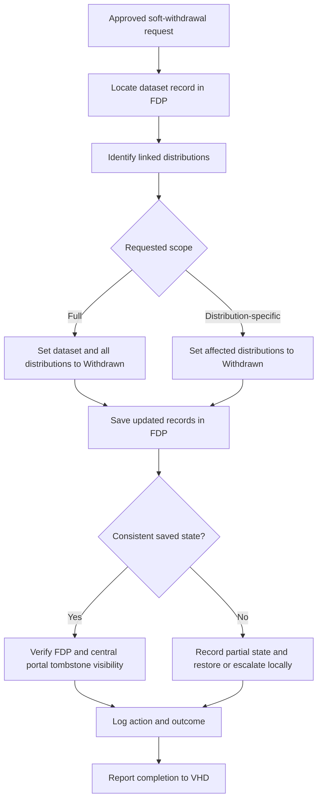

# European GDI - Withdraw dataset from Node FAIR Data Point

| Metadata             | Value                                                                 |
| -------------------- | --------------------------------------------------------------------- |
| Template SOP number  | `GDI-SOP0011`                                                         |
| Template SOP version | `v1`                                                                  |
| Topic                | Technical infrastructure & software development                       |
| Template SOP Type    | Node-specific SOP                                                      |
| GDI Node             |                                                                       |
| Instance version     |                                                                       |

## Index

1. [Document History](#1-document-history)
2. [Glossary](#2-glossary)
3. [Roles and Responsibilities](#3-roles-and-responsibilities)
4. [Purpose](#4-purpose)
5. [Scope](#5-scope)
6. [Introduction and Background Information](#6-introduction-and-background-information)
7. [Summary or Context Diagram](#7-summary-or-context-diagram)
8. [Procedure](#8-procedure)
9. [References](#9-references)

### 1. Document History

| Template Version | Instance version | Author(s)                   | Description of changes                                                                                                                                               | Date         |
| ---------------- | ---------------- | --------------------------- | -------------------------------------------------------------------------------------------------------------------------------------------------------------------- | ------------ |
| `v1.0.1`         |                  | Hans-Christian van der Werf | Clarified soft withdrawal scope, verification expectations, recovery handling, and minimum audit logging after PR review. | `2026.05.20` |
| `v1`             |                  | Hans-Christian van der Werf | First markdown template version of the SOP for issue [#63](https://github.com/GenomicDataInfrastructure/standard-operating-procedures/issues/63), based on the approved draft and reviewed copy. | `2026.03.26` |
| `v0`             |                  | Marcos Casado Barbero       | Created the initial SOP request and draft content for dataset withdrawal from a Node FAIR Data Point.                                                                 | `2026.03.05` |

### 2. Glossary

Find GDI SOPs common Glossary at the [**charter document**](../../docs/GDI-SOP_charter.md).

| Abbreviation  | Description                                       |
| ------------- | ------------------------------------------------- |
| EMBL          | European Molecular Biology Laboratory            |
| EBI           | European Bioinformatics Institute                 |
| FAIR          | Findability, Accessibility, Interoperability and Reusability |
| FDP           | FAIR Data Point                                   |
| GDI           | European Genomic Data Infrastructure              |
| SOP           | Standard Operating Procedure                      |
| VHD           | Virtual Helpdesk                                  |

| Term       | Definition                                                                                                   |
| ---------- | ------------------------------------------------------------------------------------------------------------ |
| Withdrawal | A lifecycle state indicating that a dataset or distribution is no longer offered for normal use through the FAIR Data Point. |

### 3. Roles and Responsibilities

See qualifications and responsibilities of the roles at the [**Organisational Roles and Responsibilities**](../../docs/GDI-SOP_organisational-roles-and-responsibilities.md) document.

| Role       | Full name                   | GDI/node role                                    | Organisation                          |
| ---------- | --------------------------- | ------------------------------------------------ | ------------------------------------- |
| Author     | Hans-Christian van der Werf | SOP author and Task 4.3 contributor              | Health-RI                             |
| Reviewer   | Marcos Casado Barbero       | Task 4.3 member                                  | EMBL-EBI                              |
| Approver   | Gabriele Rinck              | Task 4.3 member                                  | EMBL-EBI                              |
| Authorizer | Management Board            | Authorizer according to GDI SOP governance       | GDI                                   |

### 4. Purpose

This SOP defines how a GDI node checks whether a dataset requested for withdrawal is present in its Node FAIR Data Point (FDP), follows the approved withdrawal scope received through the overarching dataset-withdrawal process, and performs a soft withdrawal in a consistent and auditable way. In this SOP, soft withdrawal means updating FDP metadata through `adms:status`, retaining withdrawn records as tombstones, and verifying both FDP state and harvested catalogue visibility.

### 5. Scope

This SOP covers the processing of an approved soft withdrawal request in a Node FAIR Data Point. It includes locating the dataset record, identifying linked distributions, following the requested withdrawal scope, applying soft withdrawal through `adms:status`, verifying the resulting visibility of the withdrawn records in the FDP and central GDI portal after harvesting, logging the action, and reporting completion to the GDI Virtual Helpdesk. It assumes that the central GDI portal harvests updated metadata automatically from the FDP and therefore does not require a separate manual re-indexing action there.

A full withdrawal means that the dataset and all linked distributions are marked as withdrawn. A distribution-specific withdrawal means that one or more affected distributions are marked as withdrawn while the dataset record itself remains active.

This SOP does not cover hard deletion, deletion of individual metadata elements within a dataset record, participant-level deletion inside a dataset, dataset versioning or replacement identifiers, or downstream withdrawal activities in other systems unless those are defined in another SOP. It also does not define disabling Beacon, downstream application programming interfaces, caches, external metadata aggregators, or downloadable assets outside the FDP and harvested central GDI portal path.

In the FAIR Data Point workflow described here, the minimum operational unit is the dataset record or a full linked distribution record. This SOP therefore covers full dataset withdrawal and distribution-specific withdrawal, but not finer-grained removal of individual metadata elements within a record.

### 6. Introduction and Background Information

A node's FAIR Data Point is often the first public-facing catalogue where a dataset becomes discoverable. Without a standard withdrawal procedure, datasets or distributions that should no longer be offered may remain visible or accessible, undermining governance, compliance, and user trust. This SOP ensures that nodes apply a consistent and auditable soft withdrawal process in the FDP while keeping withdrawn records visible as tombstones.

In this SOP, withdrawal is expressed using `adms:status`. At distribution level, `adms:status` follows the Health data catalogue application profile usage and the European Union Distribution Status vocabulary, using [`WITHDRAWN`](https://publications.europa.eu/resource/authority/distribution-status/WITHDRAWN). At dataset level, `adms:status` is used here as a GDI metadata-profile convention aligned with the Health Research Infrastructure metadata model and the GDI metadata validation profile, using [`WITHDRAWN`](https://publications.europa.eu/resource/authority/dataset-status/WITHDRAWN).

For a full withdrawal, set the dataset and all linked distributions to `Withdrawn`. For a distribution-specific withdrawal, set only the affected distributions to `Withdrawn`. In this SOP template, withdrawn records remain visible as tombstones in the FDP, and the central GDI portal is expected to reflect that state after harvesting completes.

If the user interface shows labels instead of full vocabulary links, select `Withdrawn`. If the FAIR Data Point also exposes a generic catalogue-record workflow status, do not use that field as the withdrawal instruction in this SOP. This SOP uses the dataset and distribution lifecycle status fields only. Timing and urgency are inherited from the approved withdrawal request handled through the overarching SOP0009 workflow: urgent requests must be executed according to the priority or deadline attached to that request. For a broader context of GDI SOPs, please refer to the [Charter](../../docs/GDI-SOP_charter.md#4-introduction).

### 7. Summary or Context Diagram

### 8. Procedure

#### 8.1. Confirm withdrawal request and identify dataset

| Step identifier | When | Who |
| :-------------- | :------------------------------------------------------------------ | :-------------------------------------- |
| `1`             | When a dataset withdrawal request has been approved under the overarching withdrawal process described in [GDI-SOP0009 dataset withdrawal](../european-level/GDI-SOP0009_dataset-withdrawal.md#87-per-system-dataset-withdrawal). | Node FAIR Data Point maintainer or designated metadata curator |

As the Node FAIR Data Point maintainer or designated metadata curator, confirm that the incoming request package is complete before changing metadata in the FAIR Data Point. Check that it includes:

- the original approved withdrawal request or ticket reference
- the requested scope of the withdrawal
- the relevant dataset identifier and, if the request is distribution-specific, the affected distribution identifiers

Record the dataset identifier to be used as the primary lookup key. Record the dataset title only as an additional verification check.

Follow the priority or deadline stated in the approved withdrawal request. If the request is marked urgent, process it with that urgency; this SOP does not define a separate node-specific service-level target.

- If the request package is complete, proceed to ⏩[Step 2](#82-check-presence-of-the-dataset-in-the-fair-data-point).
- If the request package is incomplete, request clarification from the GDI Virtual Helpdesk and pause the workflow until the missing information is provided.

#### 8.2. Check presence of the dataset in the FAIR Data Point

| Step identifier | When | Who |
| :-------------- | :------------------------------------------------------------------ | :-------------------------------------- |
| `2`             | After successful completion of [Step 1](#81-confirm-withdrawal-request-and-identify-dataset). | Node FAIR Data Point maintainer or designated metadata curator |

Search the FAIR Data Point for the dataset using the recorded identifier as the primary lookup key. Use the dataset title only as an additional check that the correct record has been found.

- If the dataset is found, proceed to ⏩[Step 3](#83-identify-linked-distributions-and-assess-withdrawal-scope).
- If the dataset is not found, record that outcome in the audit log and report the result back through the corresponding withdrawal request or VHD ticket.

#### 8.3. Identify linked distributions and assess withdrawal scope

| Step identifier | When | Who |
| :-------------- | :--------------------------------------- | :-------------------------------------- |
| `3`             | After step 2. | Node FAIR Data Point maintainer or designated metadata curator |

Identify all linked distributions associated with the dataset, including service endpoints, landing pages, and download links listed in the FAIR Data Point record. Follow the withdrawal scope already approved in the incoming request:

- a full withdrawal, meaning the dataset and all linked distributions
- a distribution-specific withdrawal, meaning only one or more affected distributions

- Continue to ⏩[Step 4](#84-apply-soft-withdrawal-status) once the affected records have been identified.

#### 8.4. Apply soft withdrawal status

| Step identifier | When | Who |
| :-------------- | :--------------------------------------- | :-------------------------------------- |
| `4`             | After step 3. | Node FAIR Data Point maintainer or designated metadata curator |

If the withdrawal is full:

- open the dataset record in the FAIR Data Point editor
- set dataset `adms:status` to the `WITHDRAWN` value described above
- save the dataset record
- open each linked distribution
- set distribution `adms:status` to the `WITHDRAWN` value described above
- save each distribution record

If the withdrawal is distribution-specific:

- keep the dataset record unchanged
- open each affected distribution
- set distribution `adms:status` to the `WITHDRAWN` value described above
- save each affected distribution record

Example operational instruction: go to FAIR Data Point, open the relevant record, change `Status` to `Withdrawn`, and press Save.

If any save action fails, only some affected records are updated, or the withdrawal was applied in error, stop the workflow immediately. Record the partial state in the local audit or change log. If reversal is authorized, restore the affected record or records to the last approved non-withdrawn state. Otherwise, escalate locally according to the node's operational support process and keep the withdrawal request open until the metadata state is consistent.

- Continue to ⏩[Step 5](#85-verify-log-and-report-completion).

#### 8.5. Verify, log, and report completion

| Step identifier | When | Who |
| :-------------- | :--------------------------------------- | :-------------------------------------- |
| `5`             | After step 4. | Node FAIR Data Point maintainer or designated metadata curator |

Verify in the FAIR Data Point that the withdrawal result matches the requested scope:

- full withdrawal: the dataset and all linked distributions are marked `Withdrawn`
- distribution-specific withdrawal: only the affected distributions are marked `Withdrawn`

Verify that withdrawn records remain visible as tombstones in the FAIR Data Point. After the central GDI portal has completed its automatic harvest from the FDP, verify there as well that the harvested record reflects the withdrawn tombstone state.

Record the action in the local audit or change log. At minimum, log the request or ticket reference, executor, timestamp, dataset identifier, affected distributions, approved scope, action taken, outcome (`completed`, `partial failure`, or `reversed`), and the reason if it is available in the request package. If a reversal or recovery action was required, log that action as well before proceeding.

Report completion back to the GDI Virtual Helpdesk so that requester communication continues through the VHD workflow.

### 9. References

| Reference | Description |
| --------- | ----------- |
| [1](../../docs/GDI-SOP_charter.md) | European GDI - SOP Charter (including Glossary) |
| [2](../../docs/GDI-SOP_information-service-management.md) | European GDI - Procedures for Information Service Management for SOPs |
| [3](../../docs/GDI-SOP_organisational-roles-and-responsibilities.md) | European GDI - Organisational Roles and Responsibilities |
| [4](https://github.com/GenomicDataInfrastructure/standard-operating-procedures/issues/55) | GDI SOP request for the overarching dataset withdrawal process |
| [5](https://github.com/GenomicDataInfrastructure/standard-operating-procedures/pull/62) | Pull request describing the overarching withdrawal process triggered before this SOP |
| [6](https://healthdataeu.pages.code.europa.eu/healthdcat-ap/releases/release-6/) | Health data catalogue application profile release 6, including catalogue record and distribution status guidance |
| [7](https://github.com/Health-RI/health-ri-metadata/blob/develop/README.md) | Metadata documentation from the Health Research Infrastructure project, including dataset and distribution `adms:status` usage |
| [8](https://publications.europa.eu/resource/authority/dataset-status/WITHDRAWN) | European Union Dataset Status vocabulary entry for `Withdrawn` |
| [9](https://publications.europa.eu/resource/authority/distribution-status/WITHDRAWN) | European Union Distribution Status vocabulary entry for `Withdrawn` |
| [10](https://github.com/GenomicDataInfrastructure/gdi-metadata) | GDI metadata model and validation profile |
